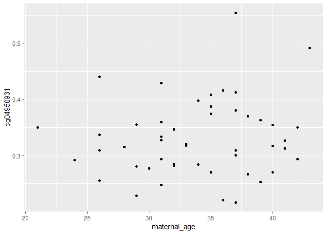
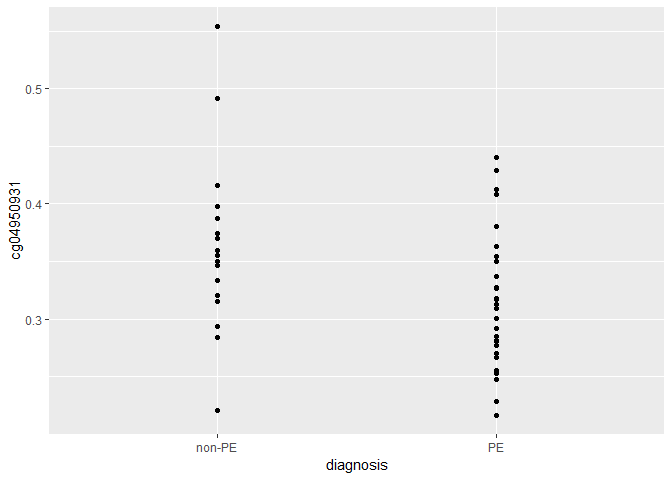
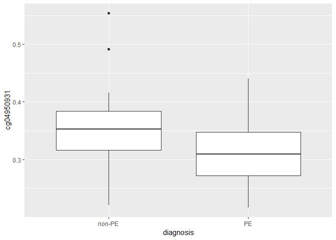
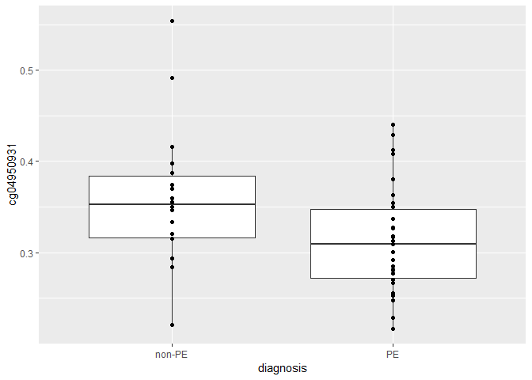

Who: Victor Yuan

What: Using ggplot2 to plot in R

Where: BC Children's Hospital Research Institute

When: July 24, 2019

# Introduction 

## Who is this tutorial for?

Beginners in R, who have little to no experience with plotting in R. I've tailored this to the TOG 
study group by making common visualizations of omics data, but this tutorial is easily generalizable 
to other types of data.

## What is ggplot2?

* ggplot2 is an R package for data visualization using the 'Grammar of Graphics' system proposed by [Leland Wilkinson (2005)](#References) (**gg**plot2 = **G**rammar of **G**raphics)
* That might sound complicated, but the result is that ggplot2 is based on a few sets of core principles,
which makes it easy to learn and easy to customize graphics to your liking

## Components of a ggplot

There are several components of every ggplot2 graph. Every ggplot2 graph requires *at least* two components:

1. **Data**. In ggplot2 we use "aesthetic mappings" to tell which variables go to what component of the graph (e.g. x-axis, y-axis, color, shape, etc.)

2. **Layers - geoms**. The type of graph or **geom**etric objects that the data are to be represented by is specified by "**geoms**". For example, `geom_boxplot` creates a box plot, `geom_point` creates points on the graph, `geom_bar` creates bar plots, ..., etc. 


Some components are not always required but are very often used to change the appearance of graphs:

3. **Layers - stats**. Certain statistical transformations can be specified using **stats** layers. For example, if we wanted ggplot2 to create a histogram over a continuous variable, we would need to indicate how big the bins are. 


4. **Scales**. **Scales** specify *how* data is mapped to the "aesthetics" of the graph. For example, if we wanted to color data points by *sex*, we can indicate what colors to use by using **scales**, otherwise ggplot2 will use a default color palette.

5. **Coordinate system**. Use this to flip axes, change to polar coordinates, or map to a geographical map (or any other image).

6. **Facets**. Graphs can be broken up into several subsets by using **facetting**

7. **Theme**. Changes the finer aspects of graphs, e.g. text size, grid lines, legend position. Sensible defaults are used.


# Workshop 

## Setup

For this workshop you need to install the following libraries:

Make sure you have a recent version of R.


```r
install.packages(c('ggplot2', 'readr', 'dplyr'))
```

Then to load it into an R session:


```r
library(ggplot2)
library(readr)
library(dplyr) # for data manipulation
```

We will be working with a 48 sample dataset of studying molecular changes associated with preeclampsia (citation).

To read in this data:


```r
data <- read_csv('https://raw.githubusercontent.com/wvictor14/TOG/master/data/GSE98224.csv')
```

```
## Parsed with column specification:
## cols(
##   .default = col_double(),
##   expr_geo_id = col_character(),
##   meth_geo_id = col_character(),
##   diagnosis = col_character(),
##   tissue = col_character(),
##   maternal_ethnicity = col_character()
## )
```

```
## See spec(...) for full column specifications.
```

```r
data
```

```
## # A tibble: 48 x 159
##    expr_geo_id meth_geo_id diagnosis tissue maternal_age maternal_bmi
##    <chr>       <chr>       <chr>     <chr>         <dbl>        <dbl>
##  1 GSM1940495  GSM2589532  PE        Place~           37         19.5
##  2 GSM1940496  GSM2589533  PE        Place~           40         25.7
##  3 GSM1940499  GSM2589534  PE        Place~           37         25  
##  4 GSM1940500  GSM2589535  PE        Place~           38         26.2
##  5 GSM1940501  GSM2589536  PE        Place~           33         31.2
##  6 GSM1940502  GSM2589537  PE        Place~           26         31.2
##  7 GSM1940505  GSM2589538  PE        Place~           31         18.6
##  8 GSM1940506  GSM2589539  PE        Place~           37         25.2
##  9 GSM1940507  GSM2589540  non-PE    Place~           35         18.6
## 10 GSM1940508  GSM2589541  PE        Place~           32         26.6
## # ... with 38 more rows, and 153 more variables: maternal_ethnicity <chr>,
## #   ga_weeks <dbl>, ga_days <dbl>, transcript_8033795 <dbl>,
## #   transcript_8103881 <dbl>, transcript_7904014 <dbl>,
## #   transcript_8127692 <dbl>, transcript_7990031 <dbl>,
## #   transcript_8121144 <dbl>, transcript_8150846 <dbl>,
## #   transcript_7962246 <dbl>, transcript_7941890 <dbl>,
## #   transcript_7896644 <dbl>, transcript_7992897 <dbl>,
## #   transcript_7973002 <dbl>, transcript_7979800 <dbl>,
## #   transcript_8112007 <dbl>, transcript_8036686 <dbl>,
## #   transcript_8001325 <dbl>, transcript_8180328 <dbl>,
## #   transcript_8109283 <dbl>, transcript_8041223 <dbl>,
## #   transcript_8144703 <dbl>, transcript_7997556 <dbl>,
## #   transcript_7955896 <dbl>, transcript_7939897 <dbl>,
## #   transcript_8035078 <dbl>, transcript_8113094 <dbl>,
## #   transcript_7893397 <dbl>, transcript_8110708 <dbl>,
## #   transcript_8102610 <dbl>, transcript_8083407 <dbl>,
## #   transcript_8174592 <dbl>, transcript_7922299 <dbl>,
## #   transcript_7979269 <dbl>, transcript_8074593 <dbl>,
## #   transcript_7967810 <dbl>, transcript_8052562 <dbl>,
## #   transcript_7927775 <dbl>, transcript_8005601 <dbl>,
## #   transcript_8129974 <dbl>, transcript_8070295 <dbl>,
## #   transcript_7952795 <dbl>, transcript_8044743 <dbl>,
## #   transcript_7896053 <dbl>, transcript_7894489 <dbl>,
## #   transcript_8048889 <dbl>, transcript_7894063 <dbl>,
## #   transcript_8171539 <dbl>, transcript_8011396 <dbl>,
## #   transcript_7983157 <dbl>, transcript_8171848 <dbl>,
## #   transcript_8097443 <dbl>, cg04950931 <dbl>, cg21697851 <dbl>,
## #   cg20092728 <dbl>, cg12804791 <dbl>, cg11619216 <dbl>,
## #   cg07802350 <dbl>, cg13175060 <dbl>, cg25632577 <dbl>,
## #   cg11811391 <dbl>, cg20981848 <dbl>, cg14025883 <dbl>,
## #   cg25493658 <dbl>, cg01491071 <dbl>, cg03777414 <dbl>,
## #   cg20586124 <dbl>, cg16175792 <dbl>, cg25961733 <dbl>,
## #   cg13912117 <dbl>, cg27307465 <dbl>, cg23825057 <dbl>,
## #   cg17949440 <dbl>, cg04098985 <dbl>, cg16886987 <dbl>,
## #   cg22860917 <dbl>, cg21594328 <dbl>, cg23903035 <dbl>,
## #   cg14393923 <dbl>, cg25103160 <dbl>, cg04640920 <dbl>,
## #   cg01522692 <dbl>, cg23249922 <dbl>, cg15903956 <dbl>,
## #   cg10688297 <dbl>, cg07989490 <dbl>, cg16090790 <dbl>,
## #   cg01519765 <dbl>, cg18444702 <dbl>, cg16404259 <dbl>,
## #   cg12077460 <dbl>, cg22517735 <dbl>, cg01713086 <dbl>,
## #   cg16734734 <dbl>, cg00886182 <dbl>, cg07891440 <dbl>,
## #   cg15715892 <dbl>, cg21368161 <dbl>, cg03766264 <dbl>, ...
```

Essential components: data and geom


```r
# conitnuous by continuous
ggplot(data, aes(x = maternal_age, y = cg04950931  )) +
  geom_point()
```

<!-- -->

```r
#cate by continuous
ggplot(data, aes(x = diagnosis, y = cg04950931  )) +
  geom_point()
```

<!-- -->

```r
ggplot(data, aes(x = diagnosis, y = cg04950931  )) +
  geom_boxplot() 
```

<!-- -->

```r
ggplot(data, aes(x = diagnosis, y = cg04950931  )) +
  geom_boxplot() +
  geom_point()
```

<!-- -->

# References {#References}

Wilkinson, Leland. 2005. The Grammar of Graphics. 2nd ed. Statistics and Computing. Springer.
